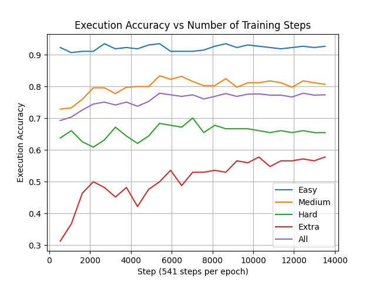
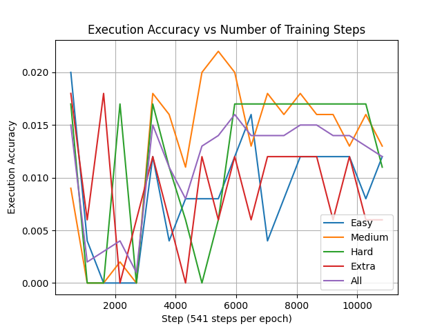

# Documentation & Results for AI Academy Project - LLM Fine-Tuning for Text-to-SQL

## Summarized Results
<table style="text-align: center;">
  <tr>
    <th style="text-align: center;">Model</th>
    <th>Method</th>
    <th>Easy</th>
    <th>Medium</th>
    <th>Hard</th>
    <th>Extra</th>
    <th>All</th>
    <th>Training time (h)</th>
    <th>Inference time (s)</th>
  </tr>

  <tr>
  <td>Count</td>
    <td>95M</td>
    <td>248</td>
    <td>446</td>
    <td>174</td>
    <td>166</td>
    <td>1034</td>
    <td>-</td>
    <td>-</td>
  </tr>

  <tr>
    <td><a href="https://huggingface.co/codellama/CodeLlama-7b-Instruct-hf">CodeLlama-7B-Instruct (Not Our Experiments)</a></td>
    <td>base</td>
    <td>0.214</td>
    <td>0.177</td>
    <td>0.092</td>
    <td>0.036</td>
    <td>0.149</td>
    <td>-</td>
    <td>-</td>
  </tr>
  <tr>
  <td></td>
    <td>lora</td>
    <td>0.923</td>
    <td>0.756</td>
    <td>0.586</td>
    <td>0.349</td>
    <td>0.702</td>
    <td>-</td>
    <td>-</td>
  </tr>
  <tr>
    <td></td>
    <td>qlora</td>
    <td>0.911</td>
    <td>0.751</td>
    <td>0.598</td>
    <td>0.331</td>
    <td>0.696</td>
    <td>-</td>
    <td>-</td>
  </tr>

  <tr>                                                      
    <td><a href="https://huggingface.co/codellama/CodeLlama-7b-Instruct-hf">CodeLlama-7B-Instruct</a></td>
    <td>base</td>
    <td>0.250 </td>
    <td>0.229</td>
    <td>0.138</td>
    <td>0.060</td>
    <td>0.191 </td>
    <td>-</td>
    <td>-</td>
  </tr>
  <tr>
    <td></td>
    <td>lora</td>
    <td>0.935</td>
    <td>0.834</td>
    <td>0.684</td>
    <td>0.5</td>
    <td>0.779</td>
    <td>16</td>
    <td>-</td>
  </tr>
  <tr>
    <td></td>
    <td>qlora</td>
    <td></td>
    <td></td>
    <td></td>
    <td></td>
    <td></td>
    <td>-</td>
    <td>-</td>
  </tr>

  <tr>                                                      
    <td><a href="https://huggingface.co/meta-llama/Meta-Llama-3-8B-Instruct">Llama3-8B-Instruct</a></td>
    <td>base</td>
    <td>0.032</td>
    <td>0.043</td>
    <td>0.034</td>
    <td>0.030</td>
    <td>0.037</td>
    <td>-</td>
    <td>-</td>
  </tr>
  <tr>
    <td></td>
    <td>lora</td>
    <td>0.012</td>
    <td>0.02</td>
    <td>0.017</td>
    <td>0.012</td>
    <td>0.016</td>
    <td>-</td>
    <td>-</td>
  </tr>
  <tr>
    <td></td>
    <td>qlora</td>
    <td></td>
    <td></td>
    <td></td>
    <td></td>
    <td></td>
    <td>-</td>
    <td>-</td>
  </tr>

  <tr>                                                      
    <td><a href="https://huggingface.co/meta-llama/CodeLlama-7b-Instruct-hf">CodeLlama-13B-Instruct</a></td>
    <td>base</td>
    <td></td>
    <td></td>
    <td></td>
    <td></td>
    <td></td>
    <td>-</td>
    <td>-</td>
  </tr>
  <tr>
    <td></td>
    <td>lora</td>
    <td></td>
    <td></td>
    <td></td>
    <td></td>
    <td></td>
    <td>-</td>
    <td>-</td>
  </tr>
  <tr>
    <td></td>
    <td>qlora</td>
    <td></td>
    <td></td>
    <td></td>
    <td></td>
    <td></td>
    <td>-</td>
    <td>-</td>
  </tr>

  <tr>
    <td><a href="https://huggingface.co/defog/sqlcoder-7b-2">sqlcoder-7b (Codellama2)</a></td>
    <td>base</td>
    <td>0.669</td>
    <td>0.540</td>
    <td>0.333</td>
    <td>0.271</td>
    <td>0.493</td>
    <td>-</td>
    <td>-</td>
  </tr> 
  <tr>
    <td></td>
    <td>lora</td>
    <td></td>
    <td></td>
    <td></td>
    <td></td>
    <td></td>
    <td>-</td>
    <td>-</td>
  </tr>
  <tr>
    <td></td>
    <td>qlora</td>
    <td></td>
    <td></td>
    <td></td>
    <td></td>
    <td></td>
    <td>-</td>
    <td>-</td>
  </tr>

  <tr>
    <td><a href="https://huggingface.co/defog/sqlcoder2">sqlcoder2-15b (starcoder)</a></td>
    <td>base</td>
    <td></td>
    <td></td>
    <td></td>
    <td></td>
    <td></td>
    <td>-</td>
    <td>-</td>
  </tr> 
  <tr>
    <td></td>
    <td>lora</td>
    <td></td>
    <td></td>
    <td></td>
    <td></td>
    <td></td>
    <td>-</td>
    <td>-</td>
  </tr>
  <tr>
    <td></td>
    <td>qlora</td>
    <td></td>
    <td></td>
    <td></td>
    <td></td>
    <td></td>
    <td>-</td>
    <td>-</td>
  </tr>

  <tr>
    <td>(Ours)</td>
    <td>base</td>
    <td></td>
    <td></td>
    <td></td>
    <td></td>
    <td></td>
    <td>-</td>
    <td>-</td>
  </tr> 
  <tr>
    <td></td>
    <td>lora</td>
    <td></td>
    <td></td>
    <td></td>
    <td></td>
    <td></td>
    <td>-</td>
    <td>-</td>
  </tr>
  <tr>
    <td></td>
    <td>qlora</td>
    <td></td>
    <td></td>
    <td></td>
    <td></td>
    <td></td>
    <td>-</td>
    <td>-</td>
  </tr>
</table>

| Model Parameters | GPU RAM | CPU RAM | DISK   |
| ---------------- | ------- | ------- | ------ |
| 7b               | 21.3GB     | 9.5GB   |  |

## Detailed Results

### CodeLlama 7B with LoRA
The best configuration was chosen based on the best execution accuracy on the spider development set which was with 10 epochs/5410 training steps. 


### Llama 3 8B with LoRA
The best configuration was chosen based on the best execution accuracy on the spider development set which was with 11 epochs/5951 training steps. 

     

## How to run the code

### Setup
Follow the instructions in the [README.md](https://github.com/ErikLarssonDev/DB-GPT-Hub/blob/main/README.md).

### Fine-Tuning 
Use the `run_all.sh` script to do a full evaluation and fine-tuning pipeline of a model. Before running the script, make sure to set all of the required parameters in `pred_eval.sh`, `train_sft.sh`, and `eval_all_checkpoints.sh`. 

- `pred_eval.sh` is used to make predictions with a model and evaluate the execution accuracy on the spider development dataset.
- `train_sft.sh` is used to fine-tune a LLM on the spider training dataset.
- `eval_all_checkpoints.sh` is used to load all checkpoints created during training to make predictions and evaluate the execution accuracy on the spider development dataset.

When the pipeline is finished you can visualize the results of the evaluation with the checkpoints by changing the `log_file_path` in `plot_pred_log.py` and running:
```bash
python dbgpt_hub/plot_pred_log.py
```

### Demo
To run a demo of the project run
```bash
python3 deployment.py
```

